# WireWhale
## 简介
#### 一个学习模仿WireShark的抓包软件。可以的功能有：侦听、解析、构造数据包等。其中还包括扩展功能：流量监测和攻击检测（Land攻击，Ping of Death）。软件目前支持解析：IP、IPv6、ARP、TCP、UDP、ICMP、ICMPv6、SSDP、HTTP、TLS。

## 主要功能
1. 侦听指定网卡或所有网卡，抓取流经网卡的数据包；
2. 解析捕获的数据包每层的每个字段，查看数据包的详细内容；
3. 可通过不同的需求设置了BPF过滤器，获取指定地址、端口或协议等相关条件的报文；
4. 针对应用进行流量监测，监测结果实时在流量图显示，并可设置流量预警线，当流量超过预警线时自动报警；
5. 提供了以饼状图的形式统计ARP、TCP、UDP、ICMP报文，以柱状图的形式统计IPv4、IPv6报文；
6. 可将抓取到的数据包另存为pcap文件，并能通过打开一个pcap文件对其中的数据包进行解析；
7. 可逐层逐字段构造数据包，实现自定义数据包发送。

## 主要模块
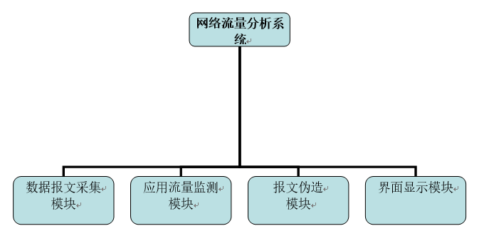
* 数据报文采集模块：完成网络接口数据的捕获、解析，可以根据用户定义条件组合来进行捕获，如只监视采用TCP或UDP协议的数据包，也可以监视用户希望关注的相关IP地址的数据包，同时完成数据封包日志记录，提高了系统的灵活性。此外，对IP类型、ARP、TCP、UDP、ICMP的数量进行统计。
* 应用流量监测模块：获取当前正在运行的应用进程，用户可选择一个应用进行流量监测，获取应用中流量信息，同时对一些常见的入侵攻击特征进行判断，如根据源目的地址是否相同判断Land攻击、IP头部长度是否过长判断ping拒绝服务攻击，并发出预警。
* 报文伪造模块：可以自行构造Ether、IP、TCP、UDP、ICMP、ARP报文，并选择send()、sendp()、sr()、srl()、srloop()五种方式发送报文以实现简单攻击或对TCP/IP进行调试。
* 界面显示模块：设计系统主窗口即数据报文采集界面、应用流量监测界面、报文伪造界面。并完成报文统计图的显示，流量图的显示。

## 源代码结构

+ **img**
存放程序中使用的背景和图标。
+ **capture_core.py**
抓包程序的后台文件，主要用来生成数据包的摘要信息、分析数据包的结构、程序状态处理、下载速度和上传速度的更新等。
+ **flow_monitor.py**
流量监控程序的后台服务代码，实时更新速度、应用流量的过滤及摘要信息的生成、更新应用的网络连接等。
+ **forged_packet**
用于构造数据包并发送，可自定义数据包的每个字段，实现网络攻击或网络欺骗等功能。
+ **main_ui.py**
抓包程序的GUI代码，包括了快捷键的绑定以及可自定义字体和背景图片、已抓到数据包的摘要信息的展示、显示某个数据包的详细信息和十六进制数据等功能。
+ **main.py**
程序的入口。
+ **monitor_system.py**
流量监控的GUI代码，用于查看网络连接速度等。
+ **tools.py**
工具代码，用于获取网卡的NIC、格式的转换、网络连接速度的获取。
+ **data.json**
用于存放程序的配置信息。

## 环境依赖
### Python 3.6、Scapy 2.4
#### Linux & Windows:
```sh
# pip install psutil scapy matplotlib pyqt5
```
#### 在Windows下，还需要
```sh
# pip install wmi pywin32
```
## 使用方法
进入项目目录
```sh
# cd WireWhale 
# python main.py
```

## 部分功能介绍
+ 主界面主要包括5个部分:
    + 菜单栏
      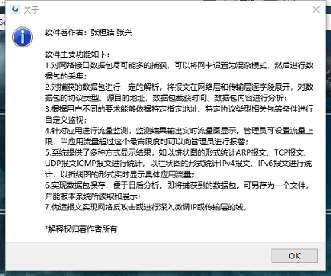
        + 文件：文件保存、打开，软件退出。
    	+ 编辑：可自行设置主窗体字体。
    	+ 捕获：捕获数据包的流程。
		+ 分析：两大拓展功能，应用流量监测和伪造数据包。
		+ 统计：报文统计。
		+ 帮助：功能介绍及版权声明。
	+ 工具栏
		+ 界面初始时，根据程序运行状态转移图只有开始键可以响应。
		+ 设置了标志位：start_flag、pause_flag、stop_flag、save_flag，用于对程序中一些函数的使用添加限制。开始、暂停、停止、重新开始四个按钮全部按照下图逻辑设置在什么情况下可响应。
		  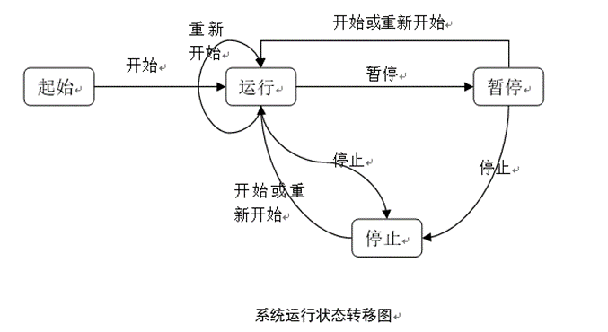
        + 下面为部分状态截图
            + 起始状态
              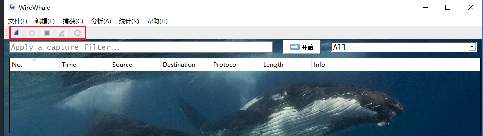
            + 运行状态
              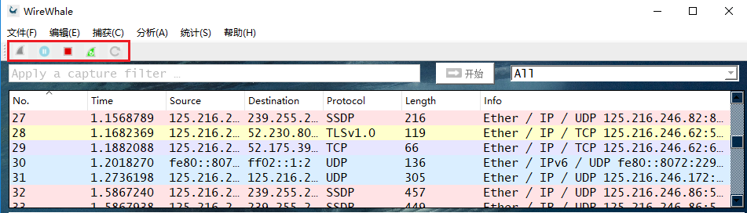
            + 暂停状态
              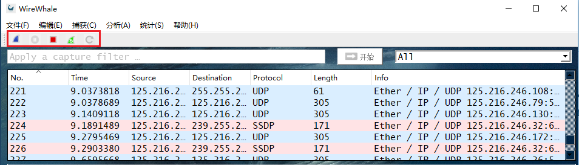
            + 停止状态
              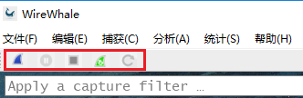
	+ 过滤器以及网卡选择
		+ 页面初始化时网卡选择下拉框获取网卡信息进行显示，如下图所示，默认全选。
		  
	+ 报文显示
		+ 根据报文类型显示不同颜色，以进行明显的区别。
		+ 报文解析以树状结构显示，层次结构清晰明了。
		+ 抓包简略信息显示框定时滑到最底部。
	+ 状态栏（显示当前网卡、实时收发包速度、上传下载速度）

+ 数据统计模块：绘制图使用python下最流行的数据处理框架Matplotlib绘制要求的统计图。
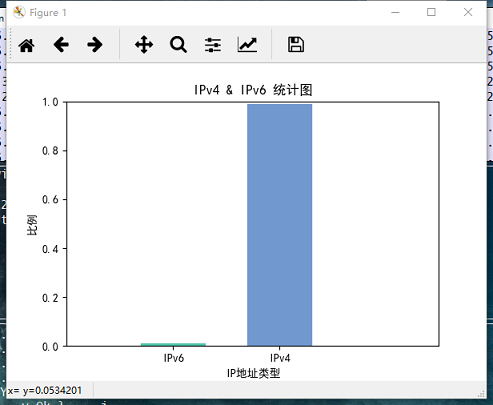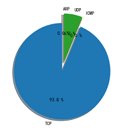

## 软件运行时部分截图
### 主程序

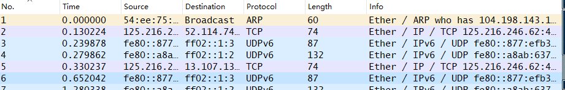
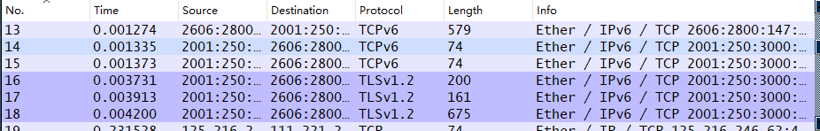
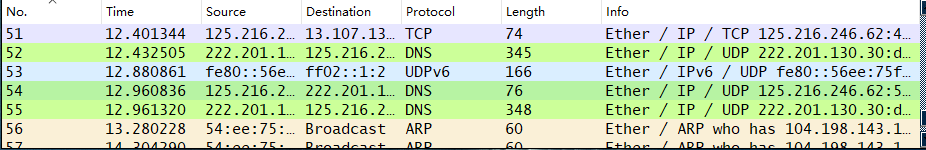

### 数据包伪造
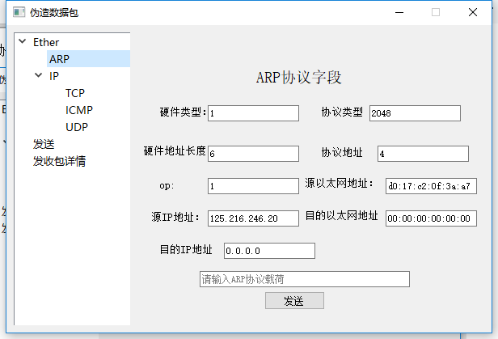
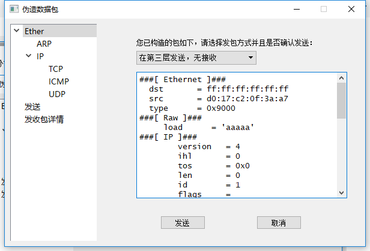

### 流量监控
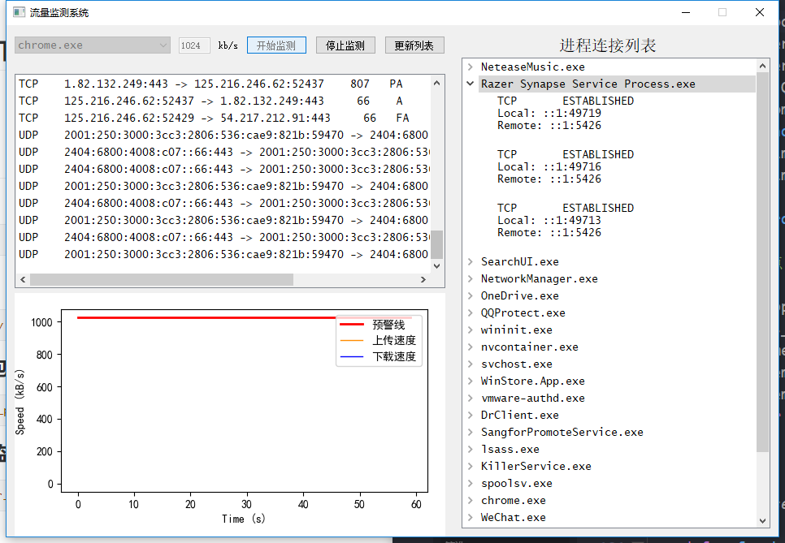