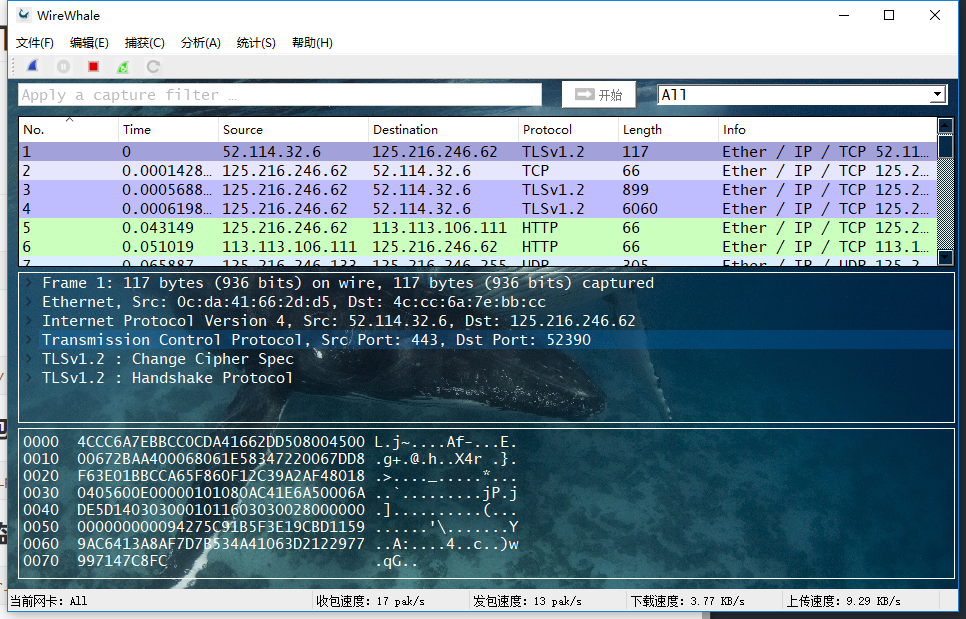
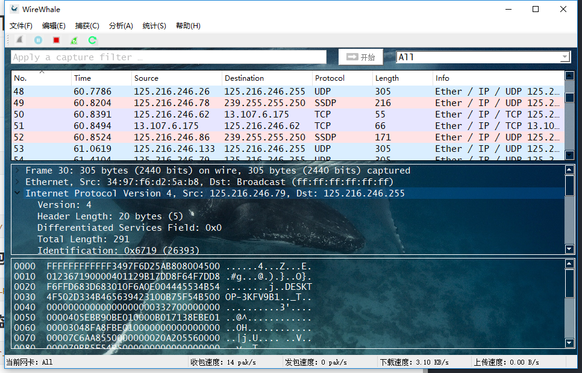
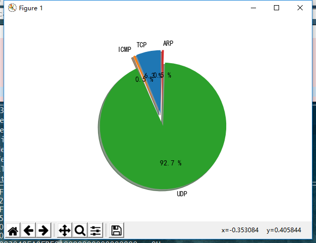
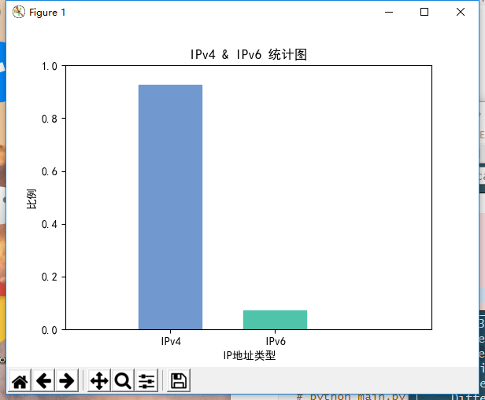
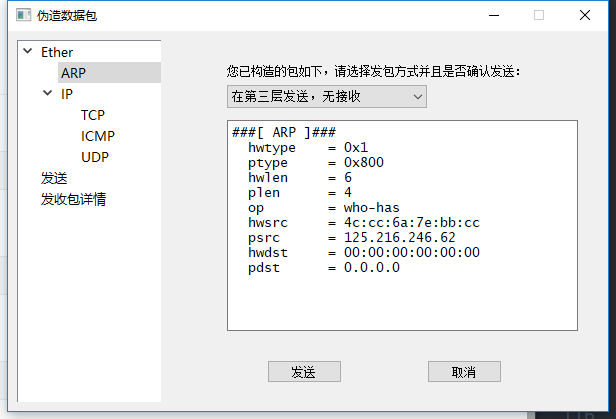
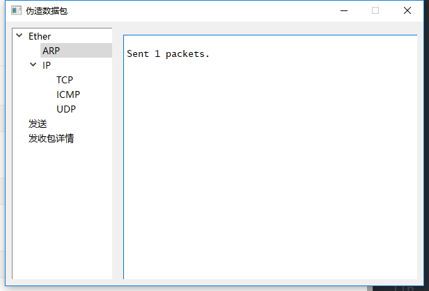

# **WireWhale**
### 一个可以侦听、解析、构造数据包的多功能抓包软件
## **简介**
#### 基于Python3.6、Scapy2.4、PyQt5，可以针对个别或所有网卡，通过输入符合BPF规则的过滤语句，对网络数据包进行抓取，并对支持协议的每个字段进行解析的抓包软件。其中还包括扩展功能：流量监测及攻击检测（Land攻击，Ping of Death）。
#### 目前支持解析的协议有：IP, IPv6, ARP, TCP, UDP, ICMP, ICMPv6常用协议及其扩展头, TLS等。

## **源代码结构**

>	+ **img**
存放程序中使用的图标。
>	+ **capture_core.py**
抓包程序的后台文件，主要用来生成数据包的摘要信息、分析数据包的结构、程序状态处理、下载速度和上传速度的更新等。
>	+ **flow_monitor.py**
流量监控程序的后台服务代码，实时更新速度、应用流量的过滤及摘要信息的生成、更新应用的网络连接等。
>	+ **forged_packet**
用于构造数据包并发送，可自定义数据包的每个字段，实现网络攻击或网络欺骗等功能。
>	+ **main_ui.py**
抓包程序的GUI代码，包括了快捷键的绑定以及可自定义字体和背景图片、已抓到数据包的摘要信息的展示、显示某个数据包的详细信息和十六进制数据等功能。
>	+ **main.py**
程序的入口。
>	+ **monitor_system.py**
流量监控的GUI代码，用于查看网络连接速度等。
>	+ **tools.py**
工具代码，用于获取网卡的NIC、格式的转换、网络连接速度的获取。
>	+ **data.json**
用于存放程序的配置信息。

## **环境依赖**
* python3.6.x
* pip
* psutil
* scapy2.4
* matplotlib
* pyqt5
## 在windows下，还需要
* wmi
* pywin32
## **使用方法**
进入项目目录
```sh
# cd WireWhale 
```
### 主程序
```sh
# python main.py
```
### 单独打开伪造包程序
```sh
# python forged_packet.py
```
### 单独打开流量监测程序
```sh
# python monitor_system.py
```
## 程序部分截图









